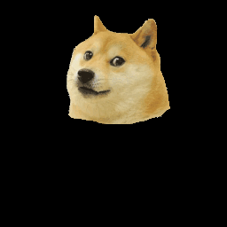
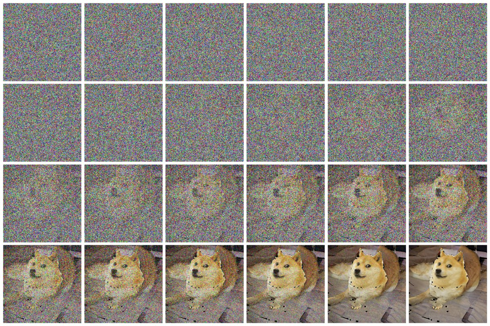
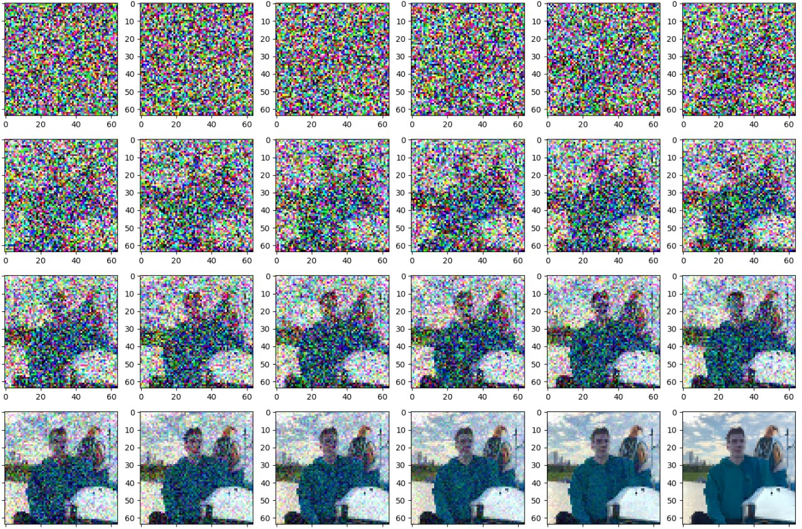

# Image Reconstruction using Diffusion Model

The code is not based on any paper. But it does something similar to [this paper](https://openaccess.thecvf.com/content/CVPR2022/papers/Lugmayr_RePaint_Inpainting_Using_Denoising_Diffusion_Probabilistic_Models_CVPR_2022_paper.pdf) or (less similar to) [this paper](https://arxiv.org/pdf/2112.10741.pdf).

Before running the code, you should install `improved-diffusion` package. Check the readme of the `improved-diffusion` folder. Note: install from my copy, and not from the original repository.

Also models `imagenet64_uncond_100M_1500K.pt` and `upsample_cond_500K.pt` need to be downloaded. Links are in the `improved-diffusion` folder.

To generate 16 samples of doge, run:

```
python generate.py --model_path imagenet64_uncond_100M_1500K.pt --input_image doge.png --batch_size 16
```

To upsample these samples from 64 to 256 resolution, run:

```
python upsample.py --upsample_model_path upsample_cond_500K.pt --lowres_images generated_doge.png.npy --input_image doge.png
```

# Results
The doge image



Turns into this (one of possible outcomes):



As you can see, the model gave doge a body.

The image of myself turned into this (right half of the image was masked off):



As you can see, the model gave me a bird.
